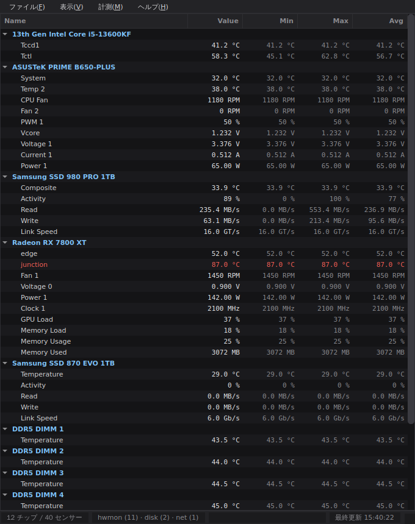
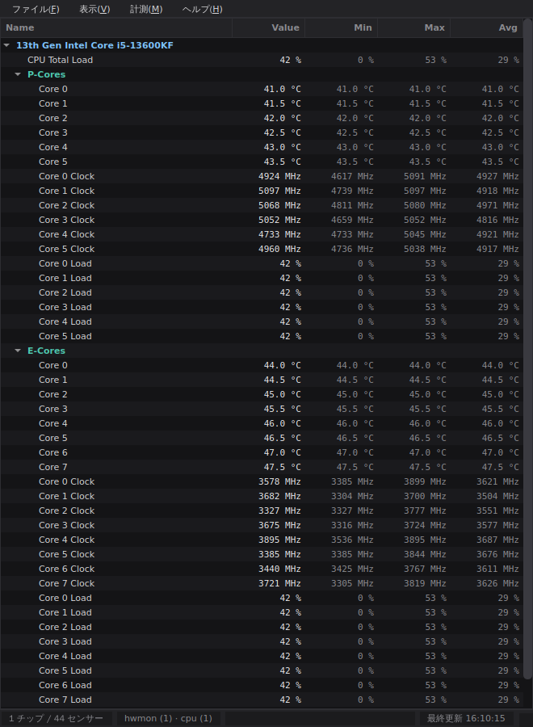

# Sensorix

Arch Linux 向けのハードウェアモニターです。Windows の CPUID **HWMonitor** に
似た見た目で、`/sys/class/hwmon/` を直接読み取り、デバイスごとのツリー表示で
**Name / Value / Min / Max / Avg** の 5 列を 1〜2 秒間隔で更新します。



CPU はコア種別ごとにまとまります (i5-13600KF の例):



## 特徴

- **依存なしで動く主経路** — `/sys/class/hwmon/hwmon*/` の `tempN_input` /
  `fanN_input` / `inN_input` などを直接読むので、root 権限もデーモンも不要です
- **デバイス名で表示** — `nvme` / `amdgpu` のようなドライバ名ではなく、
  `Samsung SSD 980 PRO 1TB` / `Radeon RX 7800 XT` / `AMD Ryzen 7 7800X3D` /
  `ASUSTeK PRIME B650-PLUS` のように実機の型番を解決して表示します
  (表示メニューでドライバ名に戻せます)
- **CPU をコア種別で分けて表示** — Intel の P / E / LPE コア、AMD の通常 / 高密度 (c)
  コアをセクションに分け、コアごとに**温度・クロック・負荷率**を表示します。
  コア番号は種別ごとに 0 から振り直すので、`coretemp` が出す
  `Core 0, 4, 8 … 24, 25` のような飛び番になりません
- **NIC の通信速度** — 各インターフェースの Download / Upload (MB/s) と
  リンク速度 (Mb/s)
- **ディスクの転送速度** — NVMe / SATA SSD / HDD の Read / Write (MB/s)、
  ビジー率、リンク速度 (SATA は 6.0 Gb/s、NVMe は PCIe の GT/s)。
  温度と同じデバイス項目にまとめて表示されます
- **Min / Max / Avg** を起動時から連続的に集計 (メニューからリセット可能)
- 温度がしきい値 (既定 80 °C) を超えた行を**赤字**で表示。
  `tempN_crit` / `tempN_emergency` / `tempN_max` を公開しているチップは、
  しきい値と実機の限界値の**低いほう**で判定します
- **lm_sensors フォールバック** — hwmon で何も取れないときは自動的に
  `sensors -j` を使います (メニューから明示的に切り替えも可能)
- **GPU 対応**
  - NVIDIA: `nvidia-smi --query-gpu=...` から温度・ファン・使用率・消費電力・
    クロック・VRAM を取得
  - AMD / Intel: `/sys/class/drm/card*/device/hwmon/hwmon*/` を hwmon として読み、
    さらに `gpu_busy_percent` や VRAM 使用量を同じグループに追加
- **GNOME / KDE のアプリ一覧に登録** — `install.sh` で .desktop とアイコンを配置。
  ランチャーの右クリックから「最前面に固定して起動」も選べます
- ダークテーマ・行高 18px の高密度レイアウト
- **常に最前面に表示** (表示メニュー / `Ctrl+T`)、ウィンドウ位置と列幅を記憶
- 監視データをテキストへ保存 (`Ctrl+S`)
- センサーが 1 つも取れなくても落ちずに、原因と対処をダイアログで案内します

## 1. 依存パッケージのインストール (Arch Linux)

### 1-1. lm_sensors (推奨・フォールバック用)

hwmon の主要なドライバはカーネル同梱ですが、Super-I/O チップ (it87, nct6775 など) は
`sensors-detect` でモジュールを特定してからでないと `/sys/class/hwmon` に現れません。

```bash
sudo pacman -S lm_sensors
sudo sensors-detect          # 基本的に Enter (デフォルト) で進み、最後に YES で保存
sudo systemctl enable --now lm_sensors   # 検出したモジュールを起動時に読み込む
sensors                      # ここで値が出れば OK
```

`sensors-detect` が提案したモジュールは `/etc/modules-load.d/lm_sensors.conf` に
書き込まれます。再起動せずに試すなら手動で読み込みます。

```bash
sudo modprobe it87    # 例: マザーボードの Super-I/O チップ
```

> **メモ:** 新しめの ASUS / Gigabyte マザーでは、ACPI と競合して `it87` が
> `-EBUSY` で失敗することがあります。その場合は
> `sudo modprobe it87 ignore_resource_conflict=1` を試してください。

### 1-2. Python と GUI

```bash
sudo pacman -S python
# uv を使う場合 (推奨)
sudo pacman -S uv
```

PySide6 は AUR ではなく pip / uv からの導入で問題ありません
(Arch 公式リポジトリの `python-pyside6` を使っても構いません)。

### 1-3. GPU 用 (任意)

```bash
sudo pacman -S nvidia-utils        # NVIDIA: nvidia-smi が入ります
# AMD / Intel は追加パッケージ不要 (amdgpu / i915 が hwmon を公開します)
```

## 2. インストール

### 推奨: インストーラを使う (GNOME / KDE のアプリ一覧に登録されます)

```bash
cd sensorix
./install.sh
```

sudo は不要です。以下がユーザー環境に配置されます。

| 配置先 | 内容 |
| --- | --- |
| `~/.local/lib/sensorix/` | アプリ本体と専用の venv (PySide6 込み) |
| `~/.local/bin/sensorix` | 起動コマンド |
| `~/.local/share/applications/sensorix.desktop` | デスクトップエントリ |
| `~/.local/share/icons/hicolor/*/apps/sensorix.png` | アイコン (16〜256px + SVG) |

インストール後は、

- **GNOME**: アクティビティ画面で「Sensorix」「温度」「sensor」などで検索
- **KDE**: アプリケーションランチャー → **システム** → Sensorix
- **端末**: `sensorix`

で起動できます。ランチャーのアイコンを右クリック (KDE) / 長押し (GNOME) すると
**「最前面に固定して起動」** のアクションが出ます。

> メニューにすぐ出ない場合は、いったんログアウト / ログインしてください。
> インストーラは `update-desktop-database` と `kbuildsycoca6` を自動実行しますが、
> シェルによってはキャッシュの再読み込みにセッションの再起動が必要です。

#### インストーラのオプション

| オプション | 説明 |
| --- | --- |
| `--system` | 全ユーザー向けに `/usr/local` へ導入 (`sudo ./install.sh --system`) |
| `--prefix DIR` | 導入先を明示 |
| `--system-pyside` | venv を作らず OS の `python-pyside6` を使う |
| `--venv` | 常に専用 venv を作る (既定の自動判定を上書き) |
| `--python PATH` | 使う python 実行ファイル |
| `--uninstall` | アンインストール |

Arch の公式パッケージで PySide6 を管理したい場合は、こちらが軽量です。

```bash
sudo pacman -S python-pyside6
./install.sh --system-pyside
```

### アンインストール

```bash
./uninstall.sh              # ユーザーインストールを削除
sudo ./uninstall.sh --system   # システムインストールを削除
```

設定 (ウィンドウ位置・列幅) は残るので、消す場合は
`rm -rf ~/.config/sensorix` を実行してください。

### インストールせずに試す

```bash
./run.sh
```

初回だけ `.venv` を作って PySide6 を入れ、以後はそのまま GUI を起動します。

### uv / pip で開発用に入れる

```bash
uv venv && uv pip install -r requirements.txt && uv run python -m sensorix
# または
python3 -m venv .venv && source .venv/bin/activate
pip install -r requirements.txt && python -m sensorix
# コマンドとして入れる
uv pip install -e .   # -> sensorix
```

## 3. 使い方

### コマンドラインオプション

```
sensorix [-i 秒] [-t °C] [-s auto|hwmon|sensors] [--no-nvidia] [--always-on-top] [-l] [-w]
```

| オプション | 説明 |
| --- | --- |
| `-i`, `--interval SEC` | 更新間隔 (既定 1.0 秒) |
| `-t`, `--threshold °C` | 赤字にする温度のしきい値 (既定 80) |
| `-s`, `--source` | `auto` (既定) / `hwmon` / `sensors` |
| `--no-nvidia` | `nvidia-smi` を呼ばない |
| `--no-net` | NIC の通信速度を表示しない |
| `--no-disk` | ディスクの転送速度を表示しない |
| `--no-cpu` | コア別のクロック・負荷率とコア種別の分類を行わない |
| `--always-on-top` | 最前面固定で起動 |
| `-l`, `--list` | **GUI を起動せず**、検出結果を一覧表示して終了 |
| `-w`, `--watch` | **GUI を起動せず**、端末上で更新し続ける (Ctrl+C で終了) |

まず GUI なしで認識状況を確かめたいときは、これが手軽です。

```bash
./run.sh --list
```

2 秒間隔・しきい値 85 °C・最前面で起動する例:

```bash
./run.sh -i 2 -t 85 --always-on-top
```

### メニュー

| メニュー | 項目 |
| --- | --- |
| ファイル | 監視データを保存 (`Ctrl+S`) / 終了 (`Ctrl+Q`) |
| 表示 | **常に最前面に表示** (`Ctrl+T`) / **チップ名で表示** / すべて展開 / すべて折りたたむ |
| 計測 | Min/Max/Avg をリセット (`Ctrl+R`) / 更新間隔 / データ取得元 / 温度の警告しきい値 |
| ヘルプ | 診断情報 (取得元と警告の一覧) / バージョン情報 |

## 4. 表示される単位

| sysfs のファイル | 種類 | 表示 |
| --- | --- | --- |
| `tempN_input` | 温度 | °C (1/1000 倍して表示) |
| `fanN_input` | ファン回転数 | RPM |
| `inN_input` | 電圧 | V (1/1000 倍) |
| `currN_input` | 電流 | A (1/1000 倍) |
| `powerN_input` | 電力 | W (1/1,000,000 倍) |
| `freqN_input` | クロック | MHz |
| `energyN_input` | 電力量 | J |
| `pwmN` | ファン制御量 | % (0–255 を換算) |

センサー名は `tempN_label` があればそれを使い (例: `Tctl`, `Tccd1`, `edge`, `junction`)、
無ければ `Temp 1`, `Fan 2` のような既定名になります。

### 通信速度・転送速度

| 項目 | 取得元 | 表示 |
| --- | --- | --- |
| Download / Upload | `/sys/class/net/<if>/statistics/{rx,tx}_bytes` の差分 | MB/s |
| Link Speed (NIC) | `/sys/class/net/<if>/speed` | Mb/s |
| Read / Write | `/sys/block/<dev>/stat` のセクタ数の差分 (1 セクタ = 512 B) | MB/s |
| Activity | `/sys/block/<dev>/stat` の `io_ticks` の差分 | % |
| Link Speed (SATA) | `ata*/link*/ata_link/link*/sata_spd` | Gb/s |
| Link Speed (NVMe) | PCIe の `current_link_speed` | GT/s |

`lo` / `docker0` / `veth*` / `br*` などの仮想インターフェースと、
`loop*` / `zram*` / `dm-*` / `md*` などの仮想ブロックデバイスは
(`device` シンボリックリンクを持たないため) 自動的に除外されます。
起動直後の 1 回目は差分が取れないため 0 MB/s から始まります。

### CPU のコア種別と番号

`coretemp` のチャンネル名 `Core N` の `N` はトポロジの **core_id** であって、
コアの通し番号ではありません。ハイブリッド構成ではこれが飛び番になります
(i5-13600KF なら P コアが 0, 4, 8, 12, 16, 20、E コアが 24〜31)。
Sensorix は core_id を実際のコアに対応付けて、**種別ごとに 0 から番号を振り直します**。

コア種別の判定は、確実な情報源から順に試します。

| 順 | 情報源 | 対象 |
| --- | --- | --- |
| 1 | `/sys/devices/system/cpu/types/*/cpulist` | Linux 6.13 以降のハイブリッド CPU |
| 2 | `/sys/devices/cpu_core/cpus` と `/sys/devices/cpu_atom/cpus` | Alder Lake 以降 (それ以前のカーネル) |
| 3 | `cpufreq/cpuinfo_max_freq` (無ければ `acpi_cppc/highest_perf`) の段 | 上記が無い環境、および AMD |

- **LPE コア** (Meteor Lake 以降の SoC タイル上の低電力 E コア) は、`cpu_atom` に
  含まれるコアを最大クロックで 2 段に分け、低いほうを LPE として扱います
- **AMD の c コア** (Zen4c / Zen5c) は、カーネルがコア種別を公開していないため
  **最大クロックの段差から推定**します。段が 2 つあり、かつ低いほうが高いほうの
  85% 未満で、それぞれ 2 コア以上ある場合のみ分割します。AMD の preferred core
  によるコアごとの僅かなブースト差を誤検出しないよう、5% 以内は同じ段として扱います
- 段が 1 つしか無い通常の CPU は分割せず `Cores` のみになります

> **注意:** AMD の c コア判定と LPE コア判定は上記のヒューリスティックによるもので、
> 疑似 sysfs でのテストのみ行っています。実機で意図しない分割が起きる場合は
> `--no-cpu` で無効化できます。

クロックは `cpufreq/scaling_cur_freq`、負荷率は `/proc/stat` の CPU 別の行から
差分で算出します。SMT 有効時、1 物理コアのクロックは 2 スレッドの最大値、
負荷率は平均値です。AMD の `k10temp` のようにコア単位でない温度 (`Tctl`, `Tccd1`)
は `Package` セクションにまとめられます。

### デバイス名の解決方法

ドライバ名をそのまま出さず、次の順に「具体的なもの」から解決します。

| 対象 | 取得元 | 表示例 |
| --- | --- | --- |
| CPU (`k10temp`, `coretemp` …) | `/proc/cpuinfo` の `model name` | `13th Gen Intel Core i5-13600KF` |
| マザーボード (`it87`, `nct67` …) | DMI の `board_vendor` + `board_name` | `ASUSTeK PRIME B650-PLUS` |
| NVMe / SATA / HDD | sysfs の `model` (+ `vendor`) | `Samsung SSD 990 EVO Plus 2TB` |
| GPU / NIC / Wi-Fi など PCI デバイス | `/usr/share/hwdata/pci.ids` | `Radeon RX 7900 XTX` |
| **DDR5 メモリ (`spd5118`)** | SPD ハブの I2C アドレス (0x50〜0x57) | `DDR5 DIMM 1` 〜 `DDR5 DIMM 4` |
| 上記で解決できないチップ | 内蔵の説明テーブル | `ACPI Thermal Zone` |

補足:

- **`spd5118` が複数出る件** — DDR5 モジュールはスロットごとに温度センサー付きの
  SPD ハブを持つため、挿している枚数だけ同名のチップが現れます。I2C アドレスから
  スロット番号を割り出して `DDR5 DIMM 1`〜`4` と区別します。SPD が読める環境では
  モジュールの型番も詳細 (ツールチップ) に表示します
  (通常 SPD は root のみ読み取り可能なので、読めなくても動作します)
- **`iwlwifi_1` などの `_1` 付き** — hwmon は同じドライバが複数チップを登録すると
  連番を付けます。連番を除いて解決するようにしています
- **PCI ID が親にある場合** — iwlwifi は hwmon を PCI デバイスではなく wiphy の
  下に登録するため、PCI デバイスが見つかるまで親方向にたどります
- 温度が 1 つしか無く、ラベルも無いデバイスは `Temp 1` ではなく
  `Temperature` と表示します

pci.ids が無い環境ではドライバ名のまま表示されます。導入するには:

```bash
sudo pacman -S hwdata      # 多くの場合 pciutils と一緒に導入済み
```

## 5. うまく動かないとき

| 症状 | 対処 |
| --- | --- |
| センサーが 1 つも出ない | `sudo sensors-detect` を実行し、`sensors` で値が出るか確認。出るなら **計測 → データ取得元 → lm_sensors のみ** に切り替え |
| マザーの温度・ファンだけ出ない | Super-I/O 用モジュール (`it87`, `nct6775`, `nct6683` など) が未ロード。`lsmod \| grep -E 'it87\|nct67'` で確認 |
| VM / コンテナで何も出ない | ホストの hwmon はゲストに見えません。実機で実行してください |
| NVIDIA GPU が出ない | `nvidia-smi` が動くか確認 (`pacman -S nvidia-utils`) |
| `PySide6 が見つかりません` | `./install.sh` または `./run.sh` を使う |
| メニューにアプリが出ない | ログアウト / ログイン。または `update-desktop-database ~/.local/share/applications` |
| アイコンが既定のものになる | `gtk-update-icon-cache -f ~/.local/share/icons/hicolor` の後、再ログイン |
| `sensorix` コマンドが無い | `~/.local/bin` を PATH に追加 (`export PATH="$HOME/.local/bin:$PATH"`) |
| KDE でタスクバーに固定できない | `./install.sh` で入れた `sensorix` から起動してください (`python -m sensorix` で直接起動するとウィンドウクラスが `python3` になり、パネルがアプリを特定できません) |
| GPU/NIC がドライバ名のまま | `sudo pacman -S hwdata` で pci.ids を導入 |
| 正体不明のチップ名が出る | 表示メニューの「チップ名で表示」を切り、ツールチップで sysfs のパスを確認してください。対応を追加するので issue で知らせてください |
| ディスク / NIC を出したくない | `--no-disk` / `--no-net` を付けて起動 |
| コアのクロックが出ない | `cpufreq` が無い環境 (VM など) です。温度と負荷率は表示されます |
| コア種別の分割がおかしい | `--no-cpu` で無効化できます。判定根拠は「CPU のコア種別と番号」を参照 |

デスクトップ統合がうまくいかないときは、診断コマンドで原因を切り分けられます。

```bash
./install.sh --check
```

`.desktop` の場所と検証結果、`Exec` の実行可否、`StartupWMClass`、アイコンの有無、
`XDG_*` 環境変数、メニューキャッシュ更新ツールの有無をまとめて表示します。
| 権限エラー | hwmon は通常 root 不要です。特定ファイルだけ読めない場合、その項目は自動的にスキップされます |

エラーはウィンドウ下部のステータスバーに表示され、**ヘルプ → 診断情報** で全文を確認できます。

## 6. 開発

```bash
python3 tests/test_sensors.py     # 追加パッケージ不要
python3 tests/test_devices.py
python3 tests/test_cpu.py
# または
uv pip install -e '.[dev]' && pytest
```

センサーの無い環境 (VM / CI) で GUI を試すには、疑似 sysfs ツリーを使えます。

```bash
python3 tests/fake_sysfs.py /tmp/fake-sys   # 使うオプションを出力します
python -m sensorix --hwmon-root /tmp/fake-sys/class/hwmon \
                    --drm-root   /tmp/fake-sys/class/drm \
                    --net-root   /tmp/fake-sys/class/net \
                    --block-root /tmp/fake-sys/block
```

### 構成

```
install.sh               インストーラ (venv 作成・.desktop / アイコン配置)
uninstall.sh             install.sh --uninstall の別名
run.sh                   インストールせずに起動する簡易ランチャー
desktop/
└── sensorix.desktop.in  デスクトップエントリの雛形 (@EXEC@ を実パスに置換)
icons/hicolor/...        インストール用アイコン (16〜256px + scalable)
tools/render_icons.py    SVG から PNG 一式を再生成する
sensorix/
├── main.py              CLI、GUI 起動、--list / --watch
├── desktop.py           .desktop / WM_CLASS / アイコン名の共通定数
├── sensors/
│   ├── model.py         Reading / Group / Sample / Min-Max-Avg 集計
│   ├── hwmon.py         /sys/class/hwmon の読み取り (主経路) + AMD/Intel GPU
│   ├── lmsensors.py     sensors -j フォールバック
│   ├── nvidia.py        nvidia-smi
│   ├── disk.py          /sys/block の転送速度・ビジー率・リンク速度
│   ├── net.py           /sys/class/net の通信速度・リンク速度
│   ├── cpu.py           コア別クロック・負荷率
│   ├── cputopo.py       コアの対応付けと P/E/LPE・通常/高密度コアの判定
│   ├── devinfo.py       ドライバ名 → 実機の型番 の解決
│   ├── pciids.py        pci.ids のパーサ (必要なベンダーのみ遅延読み込み)
│   └── collector.py     各バックエンドの統合、同一デバイスの統合、例外の封じ込め
└── ui/
    ├── theme.py         ダークテーマ
    ├── worker.py        別スレッドでのセンサー取得
    ├── icons/           アプリアイコン (SVG + PNG) とテーマ解決
    └── main_window.py   QTreeWidget の 5 列表示
```

アイコンを描き換えたときは、次のコマンドで `icons/` を再生成します。

```bash
.venv/bin/python tools/render_icons.py
```

## ライセンス

MIT
